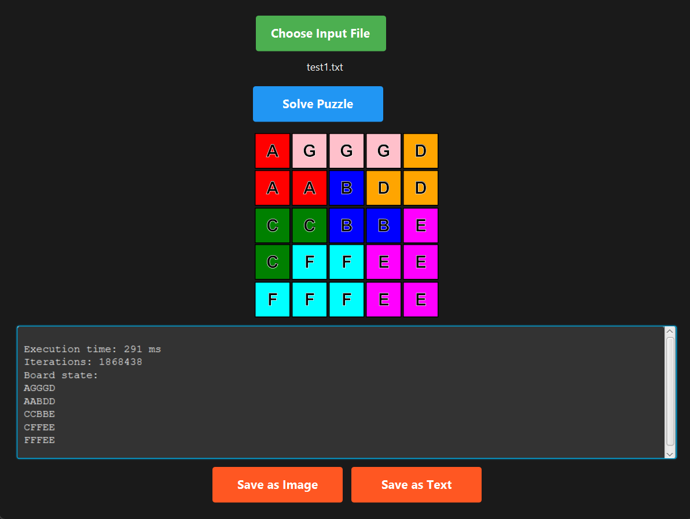

# IQ Puzzler Pro Solver



## Deskripsi Program
Program ini adalah sebuah solver untuk permainan **IQ Puzzler Pro** yang menggunakan **algoritma Brute Force** dengan teknik **rekursi dan backtracking**. Program ini memiliki fitur utama sebagai berikut:

- Memuat konfigurasi papan dan blok dari file input ".txt".
- Menyelesaikan puzzle dengan menempatkan semua blok pada papan tanpa tumpang tindih.
- Menyimpan solusi ke dalam file teks atau gambar.
- Menampilkan solusi secara visual menggunakan **antarmuka grafis (GUI)** berbasis **JavaFX**.


## Requirements

1. JavaFX
2. Extension JavaFX (Vs Code)
3. Java 23
4. Extension Pack for Java (Vs Code)
5. Apache Maven (Alternatif, jika tidak meginstall extension pack for java)


## Installation
## Cara Menjalankan Program 1
1. Buka src/puzzlesolver/src/main/java/com/App.java
2. Tekan Run
## Cara Menjalankan Program 1
1.
2.

## Struktur File
```
Tucil1_13523065
├── bin/
├── doc/
├── src/
│     ├── puzzlesolver/src/main/
│     │     ├── java/com/puzzle
│     │     │     ├── core/    # Kode logika permainan (papan,blok,solver,dll)
│     │     │     ├── utils/   # Kode utils untuk validasi input file
│     │     │     ├── App.java
|     |     |     ├── PrimaryController.java
│     │     ├── resources/com/puzzle  #Resource gui (css,fxml)
├── test/
│     ├── input/        # Input percobaan puzzle dalam txt
│     ├── output/       # Putput Hasil percobaan
```

## Author
Name : Dzaky Aurelia Fawwaz <br>  
NIM : 13523065 <br>  
Email : dzakyaureliafawwaz@gmail.com

## References
- [Spesifikasi Tugas Kecil 1 Stima 2024/2025](https://docs.google.com/document/d/1mVjS4-KAkW5fSEeKMeXJq5lArO8MIAI6a8iZYb2yc0k/edit?tab=t.0)
- [Slide Kuliah IF2211 2024/2025](https://informatika.stei.itb.ac.id/~rinaldi.munir/Stmik/2024-2025/02-Algoritma-Brute-Force-(2025)-Bag1.pdf)